# CODESCRIBE

_/koh-DEH-skribe/_

CODESYS plaintext import and export scripts.

No python installation is required to use the scripts as CODESYS ships with its own copy of Python 2.

CODESCRIBE supplies CODESYS scripts to:

- export a project to plaintext files that can be tracked in source control, as well as edited in other editors
- import plaintext files back into a CODESYS project for uploading / debugging / etc
- generate a "template" project by making a copy of the current project and deleting all exportable objects
- update the current working project from a template by copying the template file and importing plaintext files

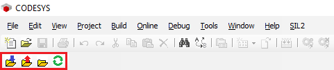

With CODESCRIBE, a CODESYS project like this:
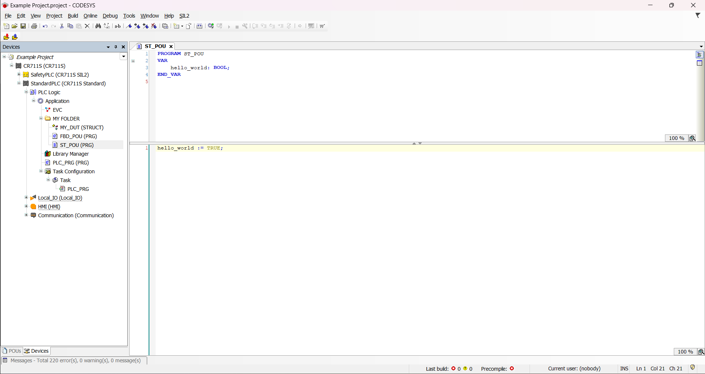

Becomes a plaintext project like this:
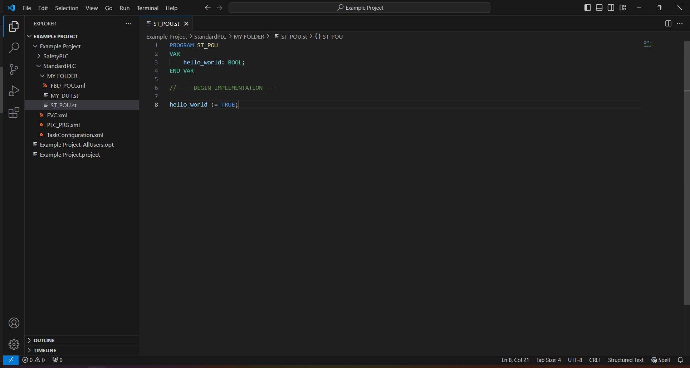

The following items are exported:

- Folders
- POUs
- EVLs
- EVCs
- Task Configurations
- DUTs
- Methods
- Properties
- Actions
- Transitions
- Communication Devices\*

\*see [Exporting and Importing Communication Devices](#exporting-and-importing-communication-devices)

Items are exported in formatted structured text (`.st`) where possible, and in native CODESYS xml everywhere else.

## Project Templates

The intention of CODESCRIBE is not to export a complete copy of the project, but to only export the implementation logic of the project, enabling collaboration via git and other source control methods. An empty, but configured, underlying project file should also be committed to the repo to manage any other configuration that CODESYS provides (e.g. project level configuration, device configuration). For example, `Example Project_template_v1.project`:

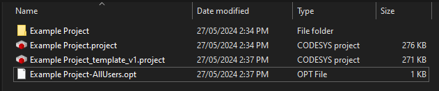

_Note, it is recommended to not source control the actual working copy of the project (`Example Project.project`) to avoid duplication._

A template file can be generated from an existing project file by using the `Save As Template` script. This script will copy the project, give it the appropriate name and delete any objects that can be imported by CODESCRIBE. If an existing project following the template naming scheme is found, the new template will use an incremented version number.

To generate a project from a template file, you need two things: the `<project_name>_template_v<X>.project` file and a folder named `<project_name>` with the files exported by the `Export To Files` script. To generate a project, copy the template project in the same location and rename it to `<project_name>.project`. Open the copy with CODESYS and use the `Import From Files` button to import the project files.

## Exporting and Importing Communication Devices

Exporting communication devices has been hardcoded to create folders for top-level devices under `Communication`. Any devices under these top-level devices will be exported using native CODESYS xml. This is done because the top-level devices can not be removed from the CODESYS project.

**If this functionality is causing you problems, it can be disabled by adding a folder with the name `_NO_EXPORT` directly under `Communication`.** You can then still rely on your project template to carry your communication configurations.

## Status

CODESCRIBE has been tested only on CODESYS V3.5 SP11, using the project structure supplied by the IFM CR711s packages.

## Installing

### Using the install script

Using the install script requires Python 3 to be installed on your system (https://www.python.org/downloads/).

Once the repo is cloned, run `install.bat` as administrator. This will in turn run `install.py`.

Once installed, proceed to [Adding the Script Toolbar to CODESYS](#adding-the-script-toolbar-to-codesys).

### Installing manually

Copy `config.json` to `C:\<CODESYS INSTALL LOCATION>\CODESYS\Script Commands`. The `Script Commands` folder may need to be created.

Open the copy of `config.json` and edit the `"Icon"` and `"Path"` fields to point to their respective locations in cloned repo (under `src` and `icons`). For example, this config:

```json
"Icon": "export_to_files.ico",
"Path": "script_export_to_files.py",
```

Should be changed to:

```json
"Icon": "<PATH TO REPO>\\icons\\export_to_files.ico",
"Path": "<PATH TO REPO>\\src\\script_export_to_files.py",
```

_NOTE: the escaped backslashes (`\\`) are required for windows paths in json_

Once installed, proceed to [Adding the Script Toolbar to CODESYS](#adding-the-script-toolbar-to-codesys).

## Adding the Script Toolbar to CODESYS

1. Select Tools -> Customize

    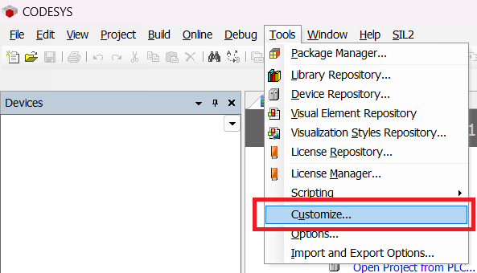

2. Select Toolbars

    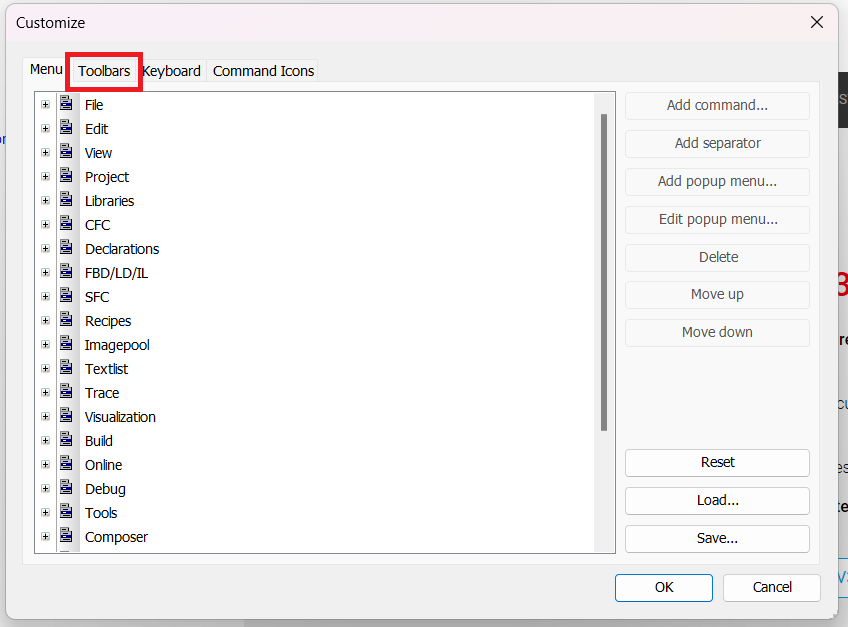

3. Select the blank toolbar at the bottom of the list and click "Add toolbar". Call it `Scripts`.

    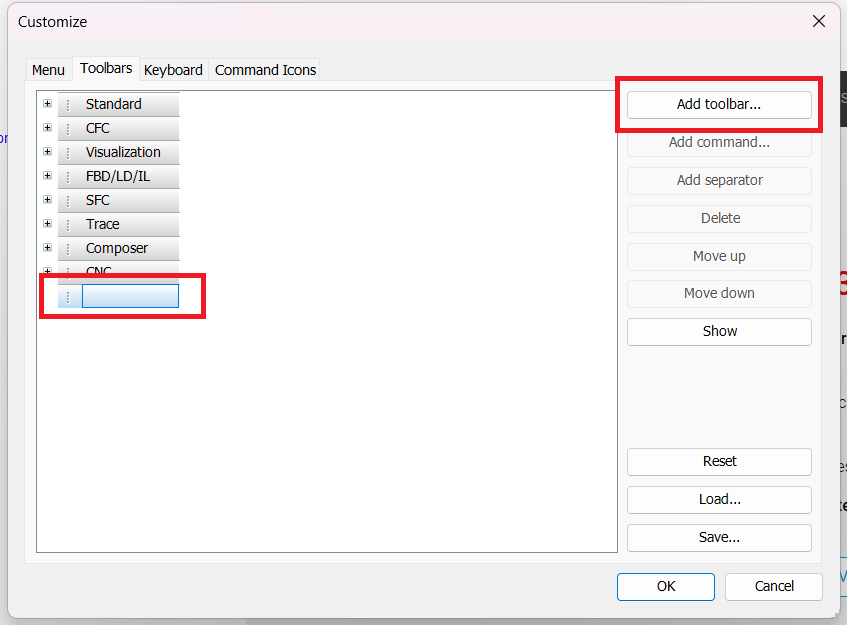

4. Expand `Scripts`, select the blank spot and click "Add command"

    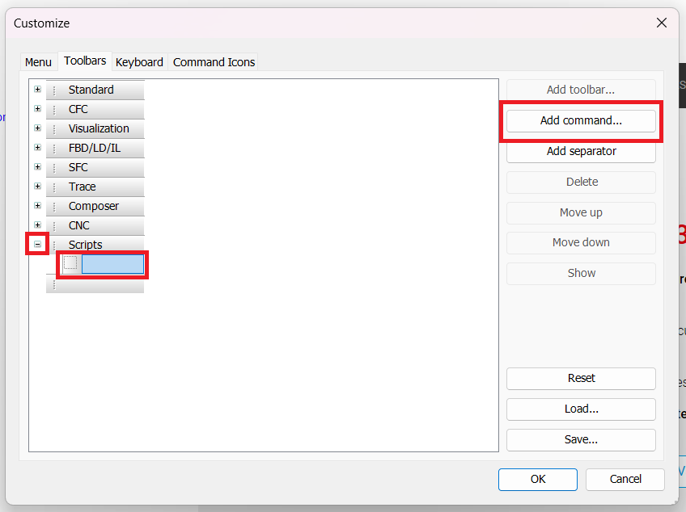

5. Under Categories, scroll down, select ScriptEngine Commands and pick the script you want to add

    - Scripts supplied by this repo are `Export To Files`, `Import From Files`, `Save As Template` and `Update From Template`

    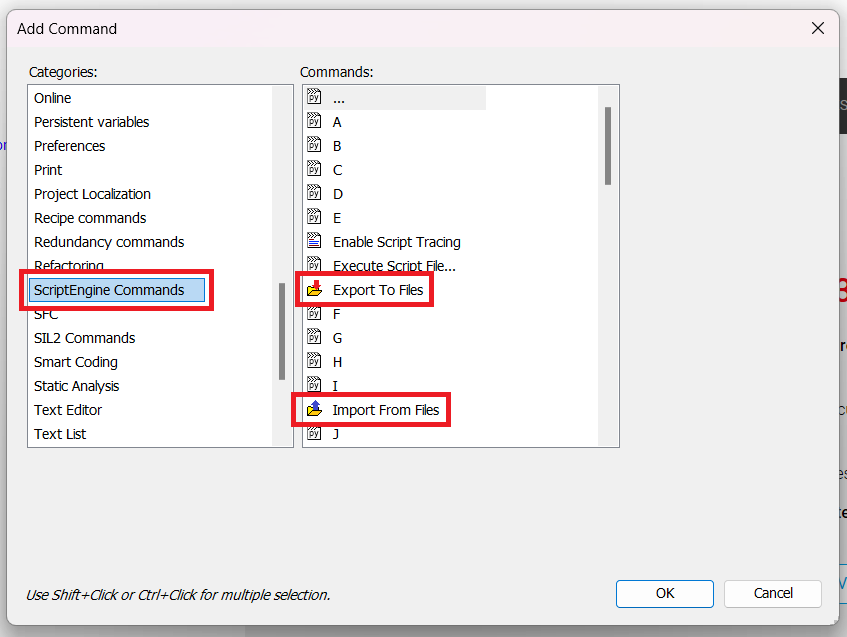

6. Repeat the process to add the other scripts

    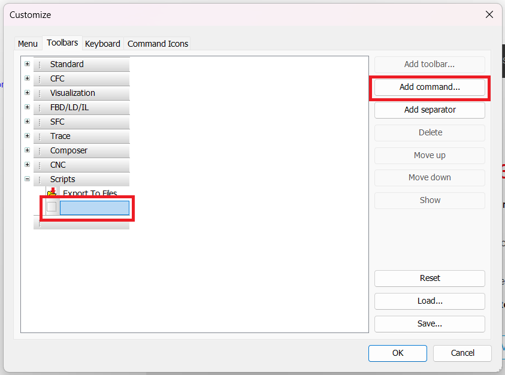

7. Click OK to save changes

    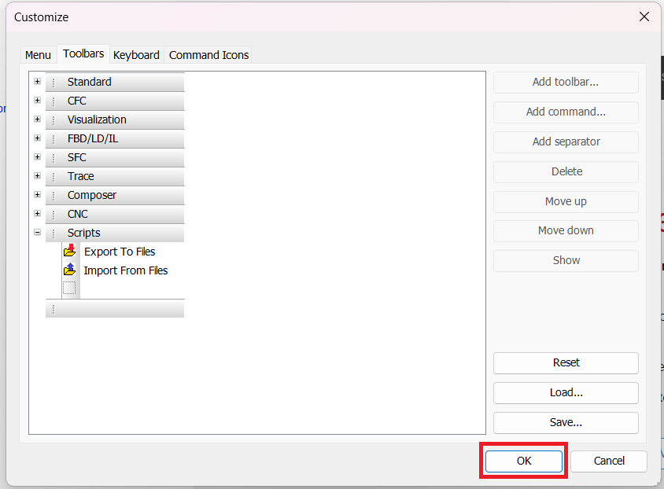

8. You should now have new icons available in your toolbar

    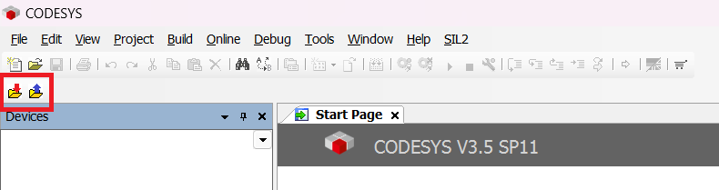

## CODESYS Scripting Docs

- https://help.codesys.com/webapp/idx-scriptingengine;product=ScriptEngine;version=3.5.10.0
- `C:\<CODESYS INSTALL LOCATION>\CODESYS\Online Help\en\ScriptEngine.chm`
